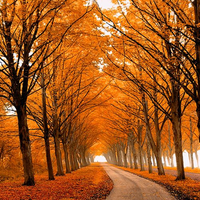

# A Collection of Small Python Scripts

This is simply a collection of scripts to make my life easier. Nearly every script has a different purpose and each of them are documented separately.

These scripts have been tested with Python 3, and may or may not work with Python 2.

## JavaScript Scripts
- [`desktopWikipedia.js`](#desktopWikipedia.js)
- [`oldReddit.js`](#oldReddit.js)

## Python Scripts
- [`crop.py`](#crop.py)
- [`makecbz.py`](#makecbz.py)

## `crop.py`
A script to crop an image in an intelligent manner trying to keep the most important parts.

Given an image the script currently maximises the crop location w.r.t. image gradients. If requested the image is first resized to fit one crop dimension.

### Requirements
- `opencv-python`
- `numpy`
- `pillow`

### Usage
    crop.py [-h] [-f] [-o OUT_FILE] img_path crop_size

positional arguments:

    img_path              Image to crop
    crop_size             Crop size as WxH

optional arguments:

    -h, --help            show this help message and exit
    -f, --fit             Resize image to fit one crop dimension
    -o OUT_FILE, --out_file OUT_FILE
                            Output file

Supply the image path, the crop size and optionally the fit parameter and output file. The crop size must be specified as `WxH` (e.g. `500x500`). If the crop size is bigger than the image, an error is printed and the script terminates. The `--fit` parameter if specified resizes the image (while maintaining the aspect ratio) to fit one of the crop dimensions. If the output file is not specified the output is placed in the same directory as the image with the name `<image>_cropped.png`

### Examples

A good and a bad example

Image | Crop without fit | Crop with fit
--- | --- | ---
 |  | 
 |  | 

It works well if the actual region of interest has the most edges, otherwise it fails since it only really looks at the density of edges in the image to decide the most important region

---

## `desktopWikipedia.js`
A simple user script to redirect mobile english wikipedia links to their desktop versions. The script replaces `en.m.wikipedia` with `en.wikipedia` in url to achieve this.

---

## `makecbz.py`
This script takes a directory as input and produces a CBZ file as output.

Given a directory with images, it first checks all images for supported formats and possible corrupted images. Once checked all images are converted to JPEG format with specified quality factor, if they are larger than specified resolution they are scaled down as well. The images are optionally renamed and packed into a zip file.

### Requirements
- `pillow`
- `tqdm`

### Usage
    makecbz.py [-h] [-r RESOLUTION] [-j] [-p] [-q QUALITY] [-n] [-d] dir_paths [dir_paths ...]

positional arguments:

    dir_paths             Directory/directories containing the images

optional arguments:

    -h, --help            show this help message and exit
    -r RESOLUTION, --resolution RESOLUTION
                          Maximum horizontal resolution
    -j, --jpeg            Convert all image files to JPEG
    -p, --png             Convert all image files to PNG
    -q QUALITY, --quality QUALITY
                          Quality parameter for JPEG (0-100) or compression level for PNG (0-9)
    -n, --no_rename       Don't rename files
    -d, --delete          Delete original files

Supply a directory or a list of directories (of images) to convert them into CBZ files. If there are non-image files, non-supported formats or corrupted images then a list of such files is printed out.

The images are scaled according to their aspect ratios and the specified `--resolution`. The standard aspect ratio is considered to be 2/3. Images with smaller aspect ratios (taller) are scaled to some multiple of `--resolution` in steps of `0.25 * --resolution`. If no resolution is specified the images are not scaled.

If `--jpeg` is speicified all images are converted to JPEG. Similarly if `--png` is specified all images are converted to PNG. If none is specified images are kept in their source format.

`--quality` specifies the JPEG compression quality or PNG compression level for `pillow`. It must be an integer between 0 and 100 for JPEG and 0-9 for PNG.

`--no-rename` if specified keeps the original file names of the images, otherwise they are renamed as `01.jpg`, `02.jpg`, `03.jpg`, ... (the numbers are padded with as many zeros as required). `--delete` if specified deletes the original image files as well as the directory.

---

## `oldReddit.js`
A simple user script variant of the Old Reddit Redirect extension by Tom Watson ([GitHub](https://github.com/tom-james-watson/old-reddit-redirect)).

This was created so that if one is already using a user script manager extension (Greasemonkey, Tampermonkey, Violentmonkey, etc.), then they don't need another extension simply for old reddit redirection.